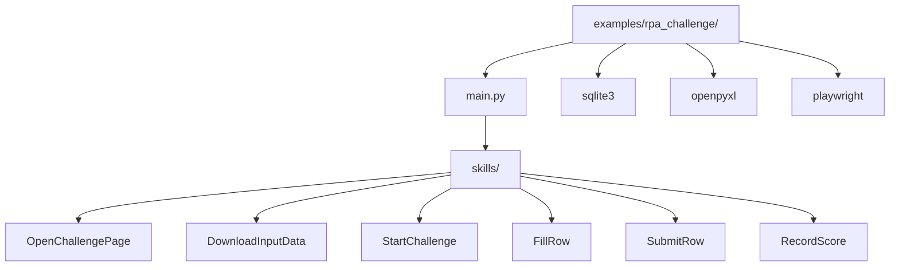

# O REF Examples

## Overview

Example repository demonstrating **label-based form filling** and **transaction-based skill execution** for RPA (Robotic Process Automation) challenges. The project shows how to download employee data from Excel, launch a Chromium browser, fill 7 randomized form fields using label-based selectors, and persist all transactions to SQLite for resume capability.

## Architecture

### Key Architectural Patterns

**One Skill Per Resource** — Each skill is a single, testable, autonomous action with a single entry point (`execute()`) and single exit (success/failure).

**Transaction Per Row** — 10 individual transactions for 10 data rows (not batched) — each transaction has its own unique reference ID for resume capability.

**Stateless Skills** — Skills read from `ctx.data["page"]` and `ctx.data["row"]` — no internal state, no hidden dependencies.

## Module Structure

| Directory | Role | Patterns | Dependencies |
|-----------|------|----------|--------------|
| `examples/rpa_challenge/` | Main application | One skill per form field, label-based selectors | `oref.Engine`, `playwright` |
| `examples/rpa_challenge/skills/` | Skill definitions | One skill per autonomous action | `playwright`, `openpyxl` |
| `examples/rpa_challenge/tests/` | Test pyramid | Mock-based unit tests + workflow tests | `unittest.mock`, `pytest` |

### Key Dependencies

| Dependency | Pattern Impact |
|------------|----------------|
| `oref.Engine` | Retry logic, transaction orchestration |
| `oref.Skill` | Atomic actions with `execute()` contract |
| `playwright.sync_api` | Label-based selectors, explicit timeouts |
| `openpyxl` | Excel parsing with schema validation |
| `sqlite3` | Transaction persistence and resume |

## Important if you are adding a new skill

1. **Create Skill Class** — Inherit from `Skill` with `execute()` method
2. **Add to Transaction** — Define in `Transaction` with `execution_order`
3. **Add to `__init__.py`** — Export the skill class

## Important if you are writing or modifying tests

1. **setup_method** — Create `mock_page`, `mock_tx`, `mock_ctx` fixtures
2. **Mock spec** — Use `Mock(spec=Transaction)` for type checking
3. **pytest.raises** — Test exception types (`SystemException`, `BusinessException`)
4. **context managers** — Use `with patch(...)` for test isolation

## Important if you are adding a new transaction

1. **Define Transaction** — Create `Transaction` with unique reference
2. **Execute Transaction** — Use `engine.run(ProcessContext(...))`
3. **Check result** — Use `if tx.status is not Status.SUCCESSFUL` with `failed_skills()`

## Important if you are adding new selectors

1. **Define Selector Constants** — `CHALLENGE_URL`, `START_BUTTON`, `DOWNLOAD_BUTTON`
2. **Create Helper Functions** — `click_button()`, `fill_field()`, `wait_for_selector()`
3. **Add to Transaction** — Skills already execute, no need to add to transaction

## Important if you are adding a new test

1. **Unit Test** — Mock browser, no real browser needed
2. **Integration Test** — Mock network + browser for end-to-end
3. **setup_method** — Create `mock_page`, `mock_tx`, `mock_ctx` fixtures
4. **pytest.raises** — Test exception types

## Important if you are adding a new component (frontend element)

Since this is a Python backend project, "frontend elements" refer to web pages and user interactions:

1. **Define Selector Constants** — `CHALLENGE_URL`, `START_BUTTON`, `DOWNLOAD_BUTTON`
2. **Create Helper Functions** — `click_button()`, `fill_field()`, `wait_for_selector()`
3. **Add to Transaction** — Skills already execute, no need to add to transaction

## Important if you are adding a new entity (data row)

1. **Define Transaction** — Create `Transaction` with unique reference `rpa-row-{email}`
2. **Execute Transaction** — Use `engine.run(ProcessContext(...))`
3. **Check result** — Use `if tx.status is not Status.SUCCESSFUL` with `failed_skills()`

## Important if you are adding a new configuration key

1. **Add to config.toml** — Define key with type and default
2. **Add validation** — Use `_validate_config()` with `isinstance()` check
3. **Add error handling** — Use `SystemException` with `action="main"`