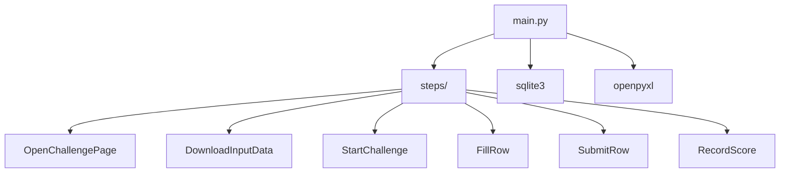

# RPA Challenge Example

## Overview

Browser automation example demonstrating **label-based form filling** for a public benchmark challenge. The application downloads employee data from Excel, launches a Chromium browser, fills 7 randomized form fields using label-based selectors, and persists all transactions to SQLite for resume capability.

## Architecture



### Key Architectural Patterns

**One Step Per Resource** — Each step is a single, testable, autonomous action with a single entry point (`execute()`) and single exit (success/failure).

**Transaction Per Row** — 10 individual transactions for 10 data rows (not batched) — each transaction has its own unique reference ID for resume capability.

**Stateless Steps** — Steps read durable row data from `ctx.state` and runtime browser handles from `ctx.resources` — no internal state, no hidden dependencies.

## Module Structure

| Directory | Role | Patterns | Dependencies |
|-----------|------|----------|--------------|
| `main.py` | Transaction orchestrator | One transaction per row, reference tracking | `rpacore.Engine`, `sqlite3` |
| `steps/` | Step definitions | One step per form field, label-based selectors | `playwright`, `openpyxl` |
| `tests/unit/` | Mock-based tests | No browser, setup_method fixtures | `unittest.mock` |
| `tests/integration/` | Workflow tests | End-to-end with mocked browser | `pytest` |

### Key Dependencies

| Dependency | Pattern Impact |
|------------|----------------|
| `rpacore.Engine` | Retry logic, transaction orchestration |
| `rpacore.Step` | Atomic actions with `execute()` contract |
| `playwright.sync_api` | Label-based selectors, explicit timeouts |
| `openpyxl` | Excel parsing with schema validation |
| `sqlite3` | Transaction persistence and resume |

## Key Patterns

### Step Layer (CRITICAL: Plain Step Interface, NOT Result<T>)

Atomic browser automation steps with explicit timeouts and error handling.

```python
from rpacore import ProcessContext, Step, SystemException

class FillRow(Step):
    def execute(self, ctx: ProcessContext) -> None:
        page = ctx.resources["page"]
        row: dict = self.arguments["row"]
        
        # Validate required fields exist
        missing = [f for f in _FIELDS if not _find_row_value(row, f).strip()]
        if missing:
            raise BusinessException(
                f"Row is missing required fields: {missing}",
                action=self.name,
            )
        
        try:
            # Build a map of label → input element
            label_map = page.evaluate("""
                () => {
                    const containers = document.querySelectorAll('rpa1-field');
                    const map = {};
                    containers.forEach(c => {
                        const label = c.querySelector('label');
                        const input = c.querySelector('input');
                        if (label && input) {
                            map[label.textContent.trim()] = input;
                        }
                    });
                    return map;
                }
            """)
            # Fill fields via JS with Angular events
            for field in _FIELDS:
                value = _find_row_value(field)
                input_el = label_map[field]
                page.evaluate(f"""
                    (el, val) => {{
                        el.value = val;
                        el.dispatchEvent(new Event('input', {{ bubbles: true }}));
                        el.dispatchEvent(new Event('change', {{ bubbles: true }}));
                    }}
                """, input_el, value)
        except Exception as exc:
            raise SystemException(
                f"Failed to fill field in row: {exc}",
                action=self.name,
            ) from exc
```

**Key aspects:**
- **Plain Step interface** — No Result<T> wrapper, direct exception handling
- **void return type** — Steps execute side effects, no data returned
- **Explicit error types** — SystemException for external failures, BusinessException for data validation
- **Timeouts** — All browser operations have explicit timeouts (10_000ms)

### Process Context Boundary (CRITICAL: durable state plus runtime resources)

Transaction creates context, steps access durable JSON-safe values via `ctx.state` and non-durable browser handles via `ctx.resources`.

```python
# Transaction definition
row_tx = Transaction(
    reference=f"rpa-row-{email}",
    steps=[
        FillRow(name="fill_row", execution_order=1, arguments={"row": row}),
        SubmitRow(name="submit_row", execution_order=2),
    ],
)

# Execute with context
engine.run(
    ProcessContext(
        transaction=row_tx,
        config=config,
        resources={"page": page},
    )
)
```

**Key aspects:**
- **durable state** — JSON-safe workflow values live in `ctx.state`
- **runtime resources** — Browser/page handles live in `ctx.resources` and are not persisted
- **no Result<T>** — State is mutated explicitly, not returned
- **arguments separate** — Step-specific data in `self.arguments`

### Error Handling Boundary (CRITICAL: SystemException vs BusinessException)

External vs data validation errors.

```python
from rpacore import SystemException, BusinessException

# SystemException - External failures (browser, network, file I/O)
class SystemException(Exception):
    def __init__(self, message: str, action: str) -> None:
        super().__init__(message)
        self.action = action

# BusinessException - Data validation errors
class BusinessException(Exception):
    def __init__(self, message: str, action: str) -> None:
        super().__init__(message)
        self.action = action
```

**Key aspects:**
- **SystemException** — External failures (browser, network, disk)
- **BusinessException** — Data validation, business logic errors
- **action field** — Identifies which step failed
- **exception chaining** — `from exc` preserves original traceback

### Browser Automation Pattern (CRITICAL: label-based selectors, NOT position-based)

Robust web automation that survives DOM changes.

```python
# Pattern: JS evaluation for dynamic DOM state
page.evaluate("""
    () => {
        const containers = document.querySelectorAll('rpa1-field');
        const map = {};
        containers.forEach(c => {
            const label = c.querySelector('label');
            const input = c.querySelector('input');
            if (label && input) {
                map[label.textContent.trim()] = input;
            }
        });
        return map;
    }
""")

# Pattern: CSS class selector (stable across DOM reordering)
page.wait_for_selector(".congratulations", timeout=15_000)

# Pattern: JavaScript function for dynamic conditions
page.wait_for_function(
    "() => { const containers = document.querySelectorAll('rpa1-field'); return containers.length >= 5; }",
    timeout=10_000
)

# Pattern: Text-based button click
page.click('button:has-text("START")', timeout=10_000)

# Pattern: Form submit button
page.locator('form input[type="submit"]').click(timeout=10_000)
```

**Key aspects:**
- **JS evaluation** — Extract dynamic DOM state (label map, element counts)
- **CSS class selectors** — Stable selectors that survive DOM reordering
- **Text-based selectors** — `button:has-text("START")` survives DOM changes
- **explicit timeouts** — All operations have timeout (10_000ms default)
- **wait_for_load_state** — Page fully loaded before proceeding

### Testing Pattern (CRITICAL: mock-based unit tests, NOT real browser)

Fast, deterministic testing without browser.

```python
class TestFillRow:
    def setup_method(self):
        """Set up test fixtures."""
        self.mock_page = Mock()
        self.mock_tx = Mock(spec=Transaction, reference="fill-row")
        self.mock_ctx = ProcessContext(
            transaction=self.mock_tx,
            resources={"page": self.mock_page, "_pw": Mock()}
        )

    def test_fills_all_fields(self):
        """Test that FillRow fills all 7 fields."""
        row = {"First Name": "John", "Last Name": "Doe", ...}
        step = FillRow("fill_row", 1, arguments={"row": row})
        step.execute(self.mock_ctx)
        
        # Verify label map was extracted and fields were filled via JS
        assert self.mock_page.evaluate.called

```

**Key aspects:**
- **setup_method** — Fixtures per test class
- **Mock spec** — `Mock(spec=Transaction)` for type checking
- **pytest.raises** — Test exception types

## Important if you are adding a new step

1. **Create Step Class** — Inherit from `Step` with `execute()` method
2. **Add to Transaction** — Define in `Transaction` with `execution_order`
3. **Add to `__init__.py`** — Export the step class

## Important if you are writing or modifying tests

1. **setup_method** — Create `mock_page`, `mock_tx`, `mock_ctx` fixtures
2. **Mock spec** — Use `Mock(spec=Transaction)` for type checking
3. **pytest.raises** — Test exception types (`SystemException`, `BusinessException`)
4. **context managers** — Use `with patch(...)` for test isolation

## Important if you are adding a new transaction

1. **Define Transaction** — Create `Transaction` with unique reference
2. **Execute Transaction** — Use `engine.run(ProcessContext(...))`
3. **Check result** — Use `if tx.status is not Status.SUCCESSFUL` with `failed_steps()`

## Important if you are adding new selectors

1. **Define Selector Constants** — `CHALLENGE_URL`, `START_BUTTON`, `DOWNLOAD_BUTTON`
2. **Create Helper Functions** — `click_button()`, `fill_field()`, `wait_for_selector()`
3. **Add to Transaction** — Steps already execute, no need to add to transaction

## Important if you are adding a new test

1. **Unit Test** — Mock browser, no real browser needed
2. **Integration Test** — Mock network + browser for end-to-end
3. **setup_method** — Create `mock_page`, `mock_tx`, `mock_ctx` fixtures
4. **pytest.raises** — Test exception types

## Important if you are adding a new component (frontend element)

Since this is a Python backend project, "frontend elements" refer to web pages and user interactions:

1. **Define Selector Constants** — `CHALLENGE_URL`, `START_BUTTON`, `DOWNLOAD_BUTTON`
2. **Create Helper Functions** — `click_button()`, `fill_field()`, `wait_for_selector()`
3. **Add to Transaction** — Steps already execute, no need to add to transaction

## Important if you are adding a new entity (data row)

1. **Define Transaction** — Create `Transaction` with unique reference `rpa-row-{email}`
2. **Execute Transaction** — Use `engine.run(ProcessContext(...))`
3. **Check result** — Use `if tx.status is not Status.SUCCESSFUL` with `failed_steps()`

## Important if you are adding a new configuration key

1. **Add to config.toml** — Define key with type and default
2. **Add validation** — Use `_validate_config()` with `isinstance()` check
3. **Add error handling** — Use `SystemException` with `action="main"`
